# 🧾 **Praktikum 9 PHP Modular**

**Universitas Pelita Bangsa – Pemrograman Web**

**Nama:** *Muhammad Aziz Tri Ramadhan*

**NIM:** *312410380*

**Kelas:** *TI.24.A3*

**Program Studi** *Informatika*

**Dosen:** Agung Nugroho, M.Kom

---

# 📘 **Praktikum 9 – Modularisasi Program PHP**

Praktikum ini membahas cara membuat **template halaman** menggunakan `header.php` dan `footer.php`, serta membuat **routing modular** agar aplikasi lebih terstruktur. Praktikum ini juga mengintegrasikan **CRUD dari Praktikum 8** ke dalam bentuk **modular**.

---

# 🎯 **Tujuan Praktikum**

1. Memahami modularisasi program PHP.
2. Menggunakan fungsi `require()` untuk memanggil template.
3. Menerapkan routing dengan parameter `page`.
4. Menggabungkan CRUD ke dalam struktur modular.
5. Membuat struktur project standar MVC sederhana.

---

# 🗂️ **Struktur Direktori Project**

```
lab9_php_modular/
│
├── index.php
│
├── config/
│   └── database.php
│
├── views/
│   ├── header.php
│   ├── footer.php
│   └── dashboard.php
│
├── modules/
│   └── user/
│       ├── list.php
│       ├── add.php
│       ├── edit.php
│       └── delete.php
│
└── assets/
    └── css/
        └── style.css
```

---

# 🧩 **Penjelasan Program per File**

---

## 1️⃣ **File: header.php**

Template bagian atas halaman yang berisi struktur HTML, judul, dan menu navigasi.

📌 *Kegunaan:*

* Agar semua halaman memiliki tampilan header yang sama.
* Modular, cukup ubah satu file untuk seluruh aplikasi.

📸 **Screenshot kode header.php:**
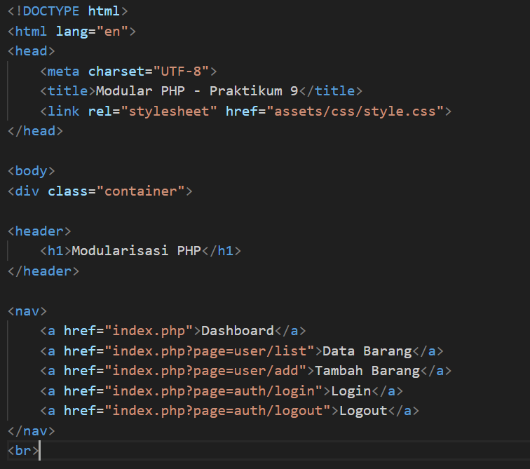

📸 **Screenshot tampilan header:**
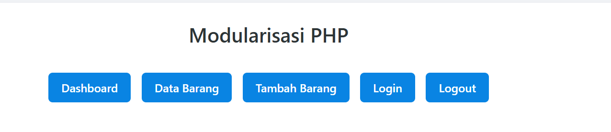

---

## 2️⃣ **File: footer.php**

Template bagian bawah halaman (closing tags HTML).

📌 *Kegunaan:*

* Menjaga konsistensi tampilan bagian bawah aplikasi.
* Mudah dipelihara.

📸 **Screenshot kode footer.php:**
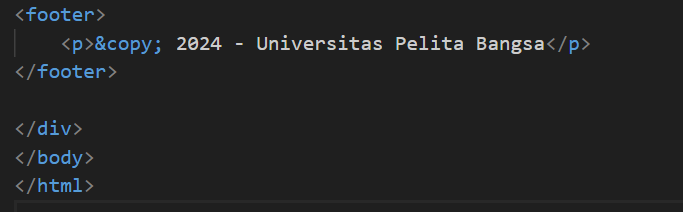

📸 **Screenshot tampilan footer:**


---

## 3️⃣ **File: index.php**

Berfungsi sebagai **routing utama**.

📌 *Penjelasan Kode Utama:*

```php
$page = $_GET['page'] ?? 'dashboard';
$path = "modules/" . $page . ".php";

require 'views/header.php';

if (file_exists($path)) {
    require $path;
} else {
    echo "<h2>Halaman tidak ditemukan!</h2>";
}

require 'views/footer.php';
```

📌 *Fungsi:*

* Menangani URL seperti:
  `index.php?page=user/list`
* Menentukan modul mana yang akan ditampilkan.

📸 **Screenshot kode index.php:**
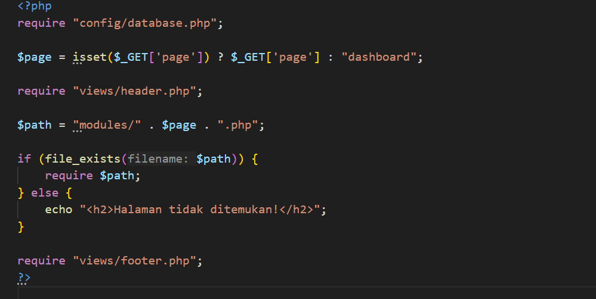

📸 **Screenshot tampilan routing berjalan:**


---

## 4️⃣ **File: database.php**

Koneksi ke MySQL menggunakan `mysqli`.

📸 **Screenshot kode database.php:**
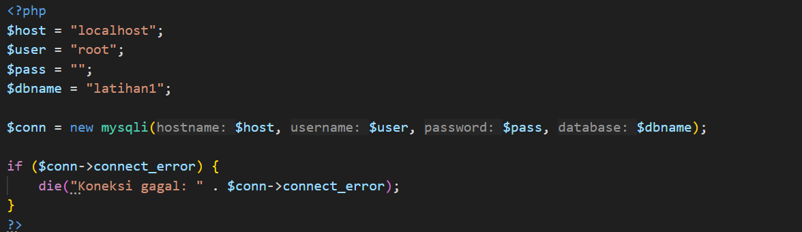

📸 **Screenshot XAMPP MySQL Running:**


---

## 5️⃣ **Folder: modules/user/**

Berisi file CRUD hasil dari praktikum 8, disesuaikan dengan struktur modular.

---

### 🔹 **list.php**

Menampilkan semua data barang.

📸 Screenshot kode:
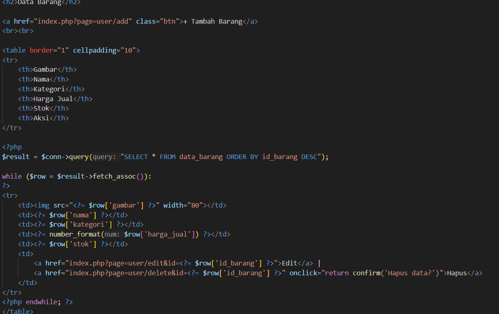

📸 Screenshot tampilan:
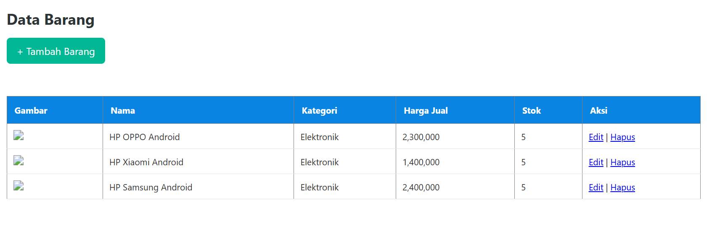

---

### 🔹 **add.php**

Form tambah data + proses insert ke database.

📸 Screenshot kode:
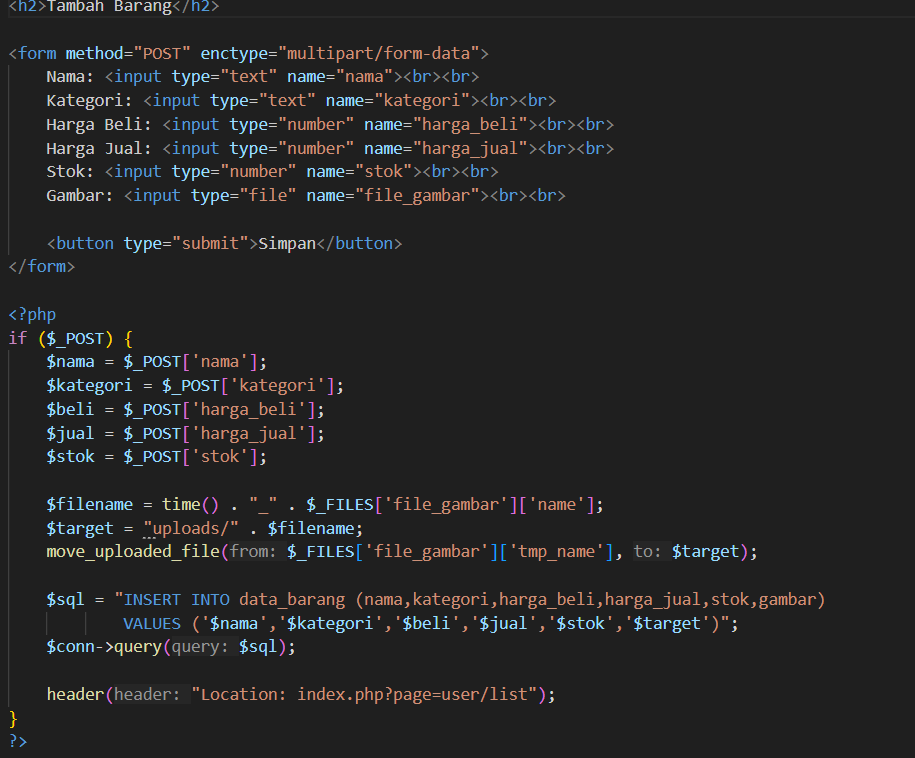

📸 Screenshot tampilan form:
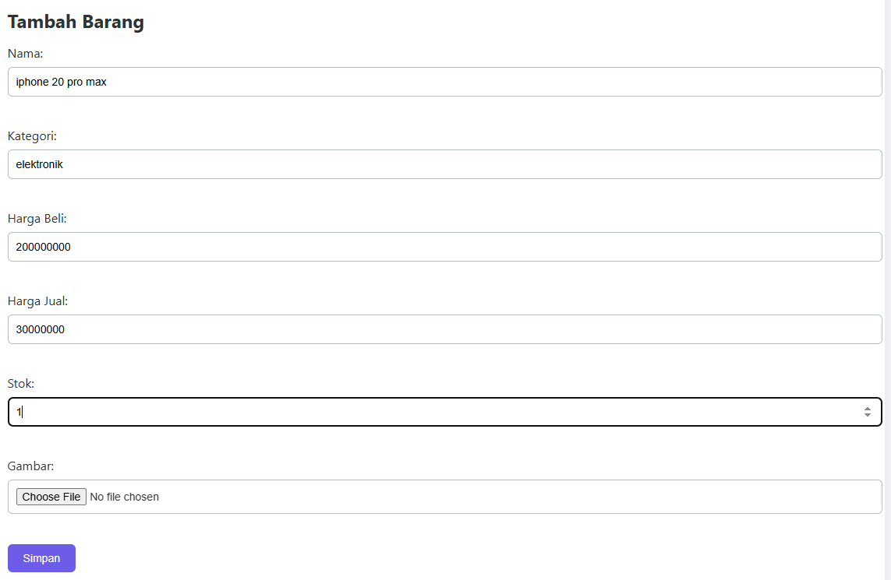

📸 Screenshot data berhasil ditambahkan:
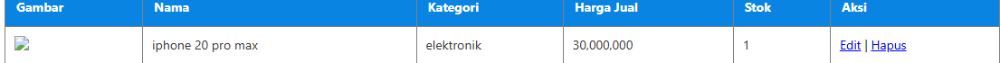

---

### 🔹 **edit.php**

Menampilkan form edit berdasarkan ID.

📸 Screenshot kode:
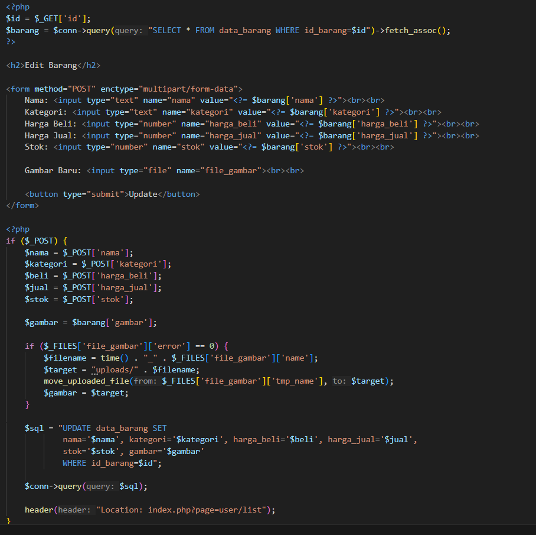

📸 Screenshot tampilan form edit:
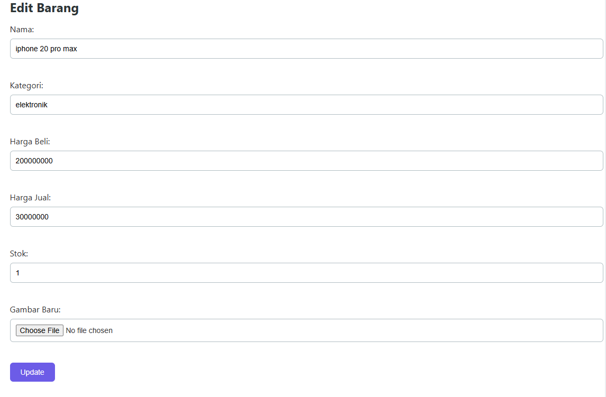

---

### 🔹 **delete.php**

Menghapus data berdasarkan ID.

📸 Screenshot kode:
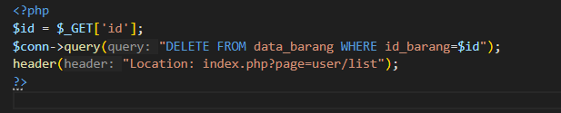

📸 Screenshot hasil delete:
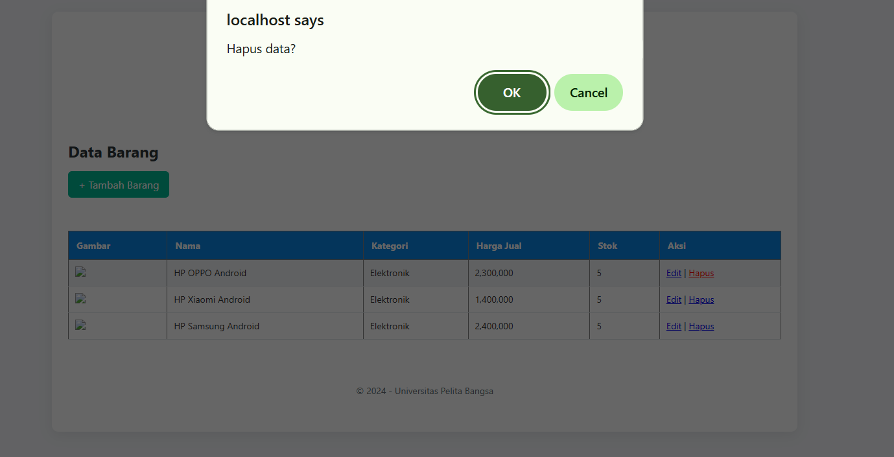

---

## 6️⃣ **File: style.css (Modern UI)**

Tampilan modern, responsive, clean.

📸 Screenshot tampilan UI:
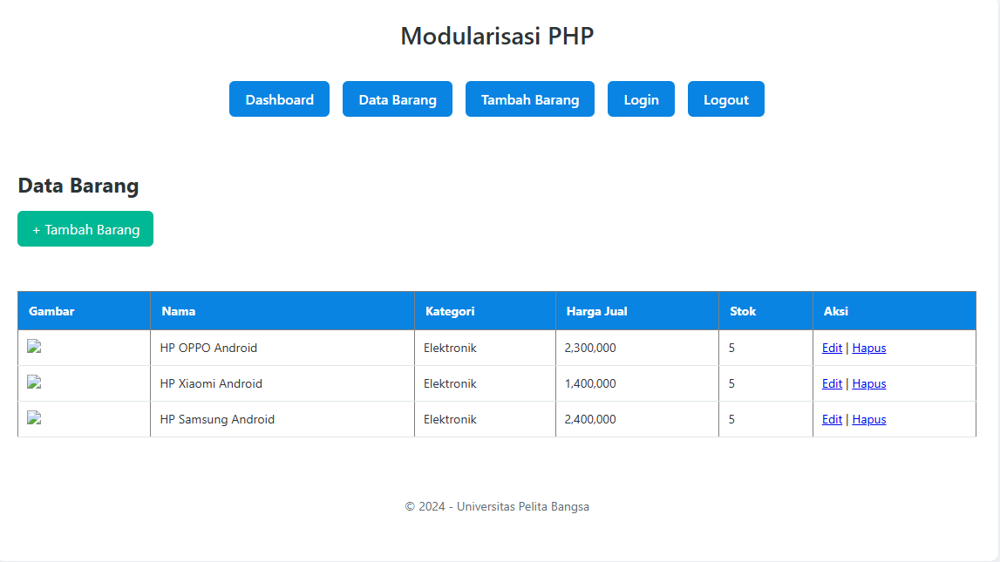

---
